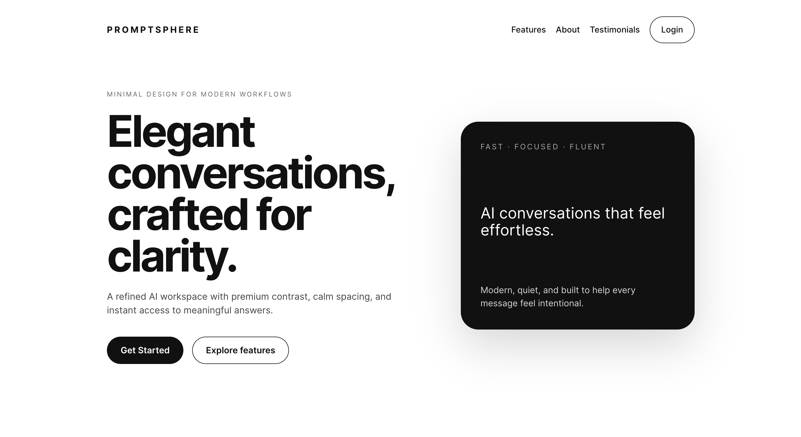
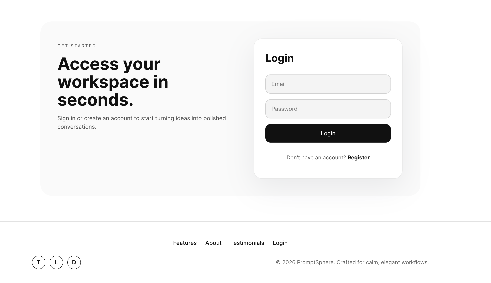
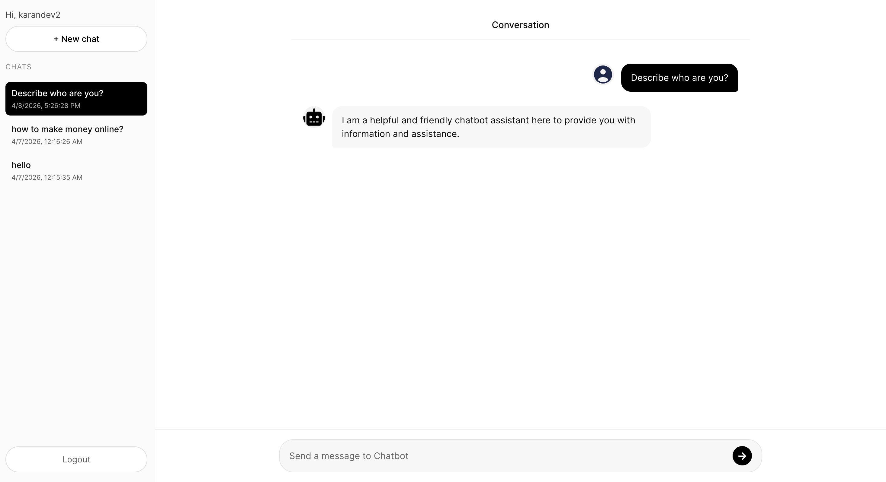
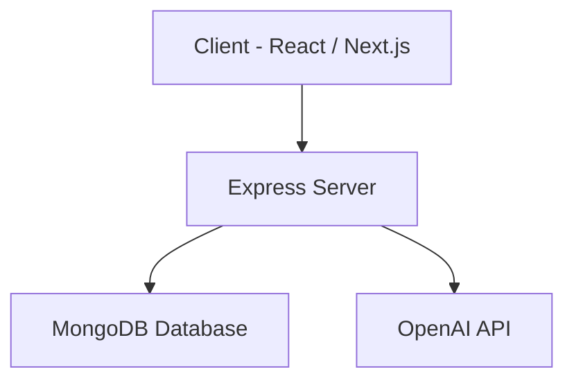

# 🚀 PromptSphere

> A minimal AI chat workspace built for speed, clarity, and real conversations.

---

## ✨ Overview

PromptSphere is a full-stack AI chat application built using the **MERN stack**, designed to deliver a clean and distraction-free conversational experience.

Unlike feature-heavy AI tools, PromptSphere focuses on:
- ⚡ Fast response cycles  
- 🧘 Minimal UI/UX  
- 💬 Persistent conversations  
- 🔐 Secure authentication  

---

## 🌐 Live Demo

👉 https://prompt-sphere-gules.vercel.app/

---

## 📸 Screenshots

### 🏠 Landing Page
<!-- ADD IMAGE HERE -->

---

### 🔐 Authentication
<!-- ADD IMAGE HERE -->

---

### 💬 Chat Interface
<!-- ADD IMAGE HERE -->

---

## 🏗️ Architecture

🛠️ Tech Stack
Frontend
* React / Next.js
* Tailwind CSS
Backend
* Node.js
* Express.js
Database
* MongoDB (Mongoose)
AI
* OpenAI API
Deployment
* Vercel (Frontend)
* Backend (Render / Railway)

🔐 Authentication
* JWT-based authentication
* Protected routes
* Secure login & registration

💬 Features
* 🧠 AI-powered conversations
* 💾 Chat history persistence
* ➕ Create multiple chats
* ⚡ Fast API responses
* 🎯 Clean and minimal UI

📂 Folder Structure
/client
  /components
  /pages
  /utils

/server
  /controllers
  /routes
  /models
  /middleware

⚙️ Installation
1. Clone the repository
git clone https://github.com/your-username/promptsphere.git
cd promptsphere

2. Setup backend
cd server
npm install
Create .env file:
MONGO_URI=your_mongodb_uri
JWT_SECRET=your_secret
OPENAI_API_KEY=your_api_key
Run server:
npm run dev

3. Setup frontend
cd client
npm install
npm run dev

🚧 Future Improvements
* 🔄 Streaming responses
* 📁 File uploads (PDF, images)
* 🔍 Chat search
* 🧠 Memory system
* 🌐 Multi-model support

📈 Learnings
* Simplicity improves retention
* UX matters more than model choice
* Latency is critical in AI apps
* Backend design is the real bottleneck

🤝 Contributing
Pull requests are welcome. For major changes, please open an issue first.

📄 License
MIT License
---

# 🧠 Architecture Diagram (Visual Upgrade)

Use this if you want something more **impressive than basic mermaid** (great for portfolio or Notion):

---

## 🔷 System Architecture

    ┌────────────────────────────┐
    │        Frontend            │
    │      React    +   UI    
    └────────────┬──────────────┘
                 │ HTTP Requests
                 ▼
    ┌────────────────────────────┐
    │        Backend API         │
    │     Node.js / Express      │
    └────────────┬──────────────┘
         │                    │
         ▼                    ▼
┌───────────────────┐ ┌────────────────────┐
│ MongoDB │ │ OpenAI API │
│ (Chat Storage) │
└───────────────────┘ └────────────────────┘
         │ (AI Responses) │
  
---

## 🔄 Request Flow

User Input
↓
Frontend (UI)
↓
Backend API
↓
OpenAI API
↓
Response Processing
↓
MongoDB Storage
↓
Frontend Update
---
