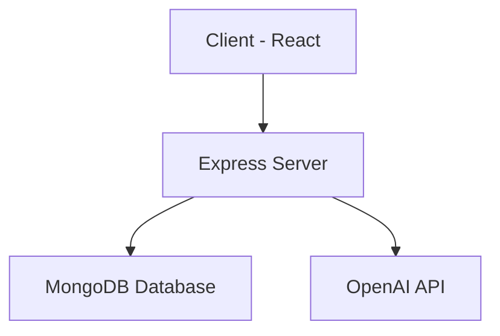

# 🚀 PromptSphere


> A minimal AI chat workspace built for speed, clarity, and real conversations.

---

## ✨ Overview

PromptSphere is a full-stack AI chat application built using the **MERN stack**, designed to deliver a clean and distraction-free conversational experience.

Unlike feature-heavy AI tools, PromptSphere focuses on:
- ⚡ Fast response cycles  
- 🧘 Minimal UI/UX  
- 💬 Persistent conversations  
- 🔐 Secure authentication  

---

## 🌐 Live Demo

👉 https://prompt-sphere-gules.vercel.app/

---

## 📸 Screenshots

### 🏠 Landing Page
<!-- ADD IMAGE HERE -->


---

### 🔐 Authentication
<!-- ADD IMAGE HERE -->


---

### 💬 Chat Interface
<!-- ADD IMAGE HERE -->


---


## 🏗️ Architecture


## 🛠️ Tech Stack

### Frontend
- React   

### Backend
- Node.js  
- Express.js  

### Database
- MongoDB (Mongoose)  

### AI Integration
- OpenAI API  

### Deployment
- Vercel (Frontend)  
- Render (Backend)  

---

## 🔐 Authentication

- JWT-based authentication  
- Protected API routes  
- Secure login & registration flow  

---

## 💬 Features

- 🧠 AI-powered conversations  
- 💾 Persistent chat history  
- ➕ Create & manage multiple chats  
- ⚡ Fast response handling  
- 🎯 Minimal and distraction-free UI  

---

## 📂 Folder Structure
backend/
├── controllers/
├── routes/
├── models/
└── middleware/

frontend/
├── src/
│ ├── components/
│ ├── pages/
│ └── assets/
└── public/


---

## ⚙️ Installation

### 1. Clone Repository

```bash
git clone https://github.com/your-username/promptsphere.git
cd promptsphere
```
### 2. Setup Backend
cd backend
npm install
### Create .env file:
- MONGO_URI=your_mongodb_uri
- JWT_SECRET=your_secret
- OPENAI_API_KEY=your_api_key
### Run server:
npm run dev


### 3. Setup Frontend
- cd frontend
- npm install
- npm run dev

### 🚧 Future Improvements
- 🔄 Streaming responses
- 📁 File uploads
- 🔍 Chat search
- 🧠 Memory system
- 🌐 Multi-model support

### 📈 Learnings
- Simplicity improves retention
- UX > model complexity
- Latency impacts engagement
- Backend design is critical

### 🤝 Contributing

Contributions are welcome.
For major changes, open an issue first.
